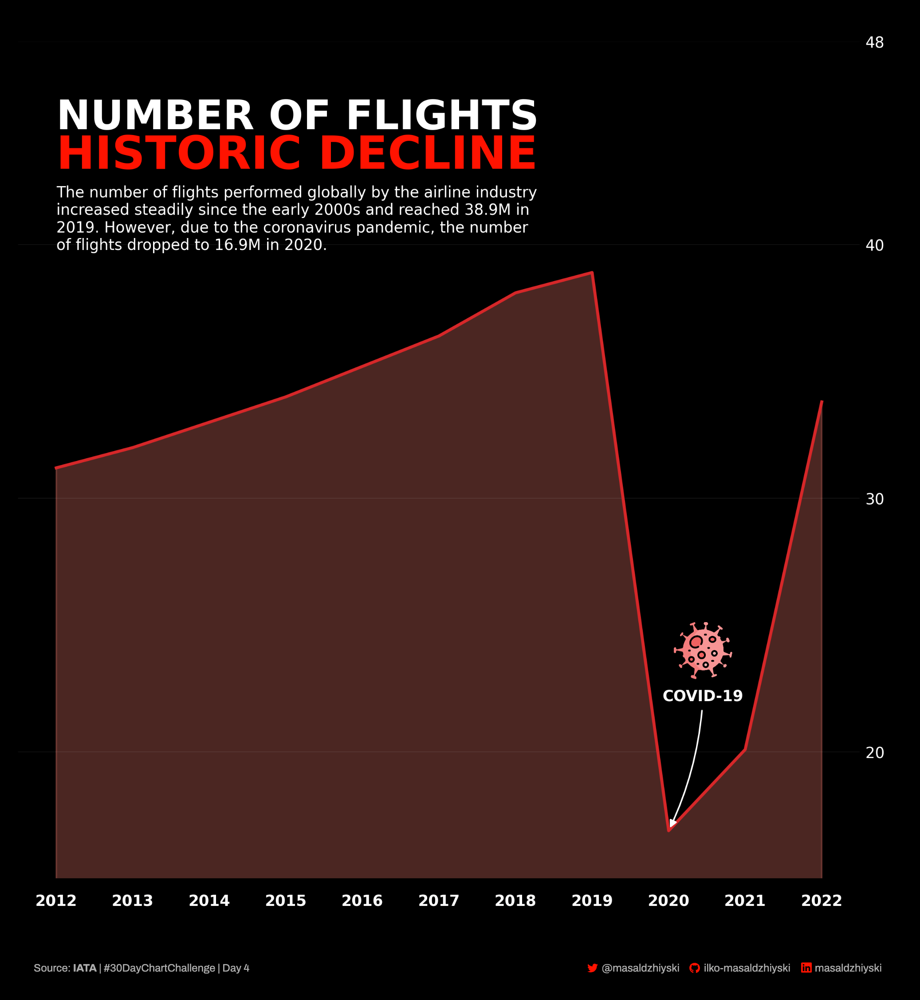
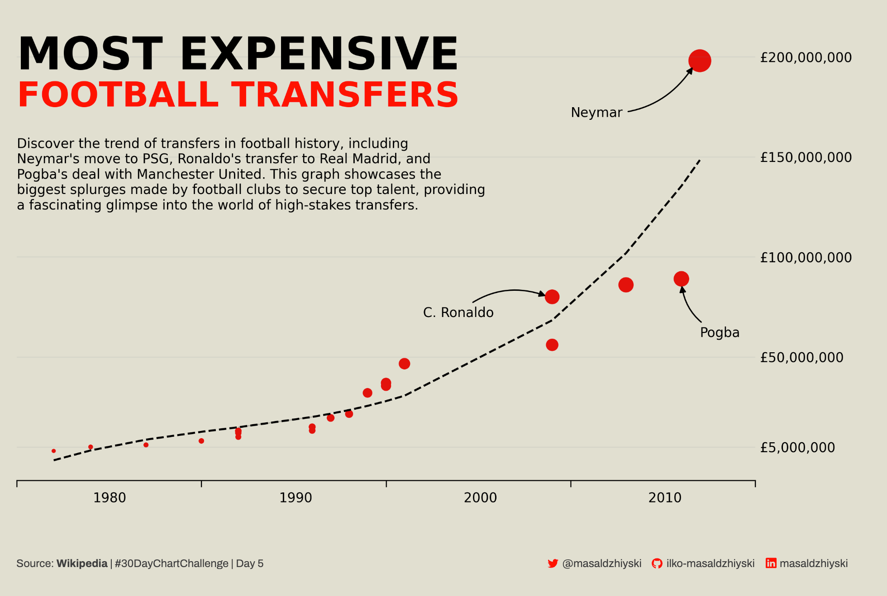

# Summary

| Day | Type | Description | Source |
|-----|------|-------------|--------|
| [1](./Day01-part-to-whole) | Part-to-whole | Share of OPEC oil reserves | [https://asb.opec.org](https://asb.opec.org) |
| [2](./Day02-waffle) | Waffle | Monthly Weather Forecast | AccuWeather |
| [3](./Day03-fauna) | Fauna | Annual rate of forest expansion and deforestation, 1990-2020 | [https://www.fao.org](https://www.fao.org) |
| [4](./Day04-historical) | Historical | Historic decline in number of flights | IATA |
| [5](./Day05-slopes) | Slopes | Development of most-expensive football transfers | [Wikipedia](https://en.wikipedia.org/wiki/List_of_most_expensive_association_football_transfers) |

# Visualizations
### [Share of OPEC oil reserves | Part-to-whole](./Day01-part-to-whole)
Confirmed oil reserves for OPEC countries.

### [Monthly Weather Forecast | Waffle](./Day02-waffle)
The 30-day forecast of my hometown in April 2023

### [Annual rate of forest expansion and deforestation, 1990-2020 | Fauna](./Day03-fauna)
Deforestation continues, but at a slower rate

### [Historic decline in number of flights](./Day04-historical)
COVID-19 slowed down the growing number of airline flights

### [Breaking football transfer records](./Day05-slopes)
Visualizing the development of most-expensive football transfers

