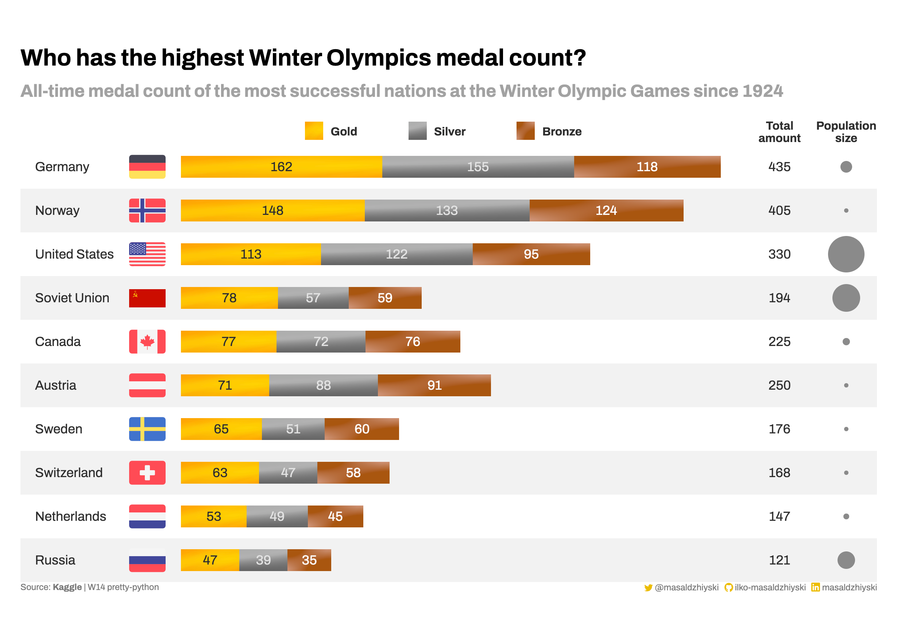

# Summary

| Week | Description | Source |
|------|-------------|--------|
| [13](./W13) | Tech industry employment trends | macrotrends.net |
| [14](./W14) | Who has the highest Winter Olympics medal count? | Kaggle |

# Visualizations
### [Tech industry employment trends](./W13)
My first proper Pandas-formatted visualization 🎉 This shows the workforce across the largest tech companies in the period 2009 - 2022.

### [Who has the highest Winter Olympics medal count?](./W14)
All-time medal count of the most successful nations at the Winter Olympic Games since 1924.

# #30DayChartChallenge
A data visualizations challenge on Twitter by [@CedScherer](https://twitter.com/CedScherer) and [@dr_xeo](https://twitter.com/dr_xeo)
I started 7 days late, so there'll be some catching up 😆

| Day | Type | Description | Source |
|-----|------|-------------|--------|
| [1](./30DayChartChallenge/Day01-part-to-whole) | Part-to-whole | Share of OPEC oil reserves | [https://asb.opec.org](https://asb.opec.org) |
| [2](./30DayChartChallenge/Day02-waffle) | Waffle | Monthly Weather Forecast | AccuWeather |
| [3](./Day03-fauna) | Fauna | Annual rate of forest expansion and deforestation, 1990-2020 | [https://www.fao.org](https://www.fao.org) |

### [Share of OPEC oil reserves | Part-to-whole](./30DayChartChallenge/Day01-part-to-whole)
Confirmed oil reserves for OPEC countries.

### [Monthly Weather Forecast | Waffle](./30DayChartChallenge/Day02-waffle)
The 30-day forecast of my hometown in April 2023

### [Annual rate of forest expansion and deforestation, 1990-2020 | Fauna](./30DayChartChallenge/Day03-fauna)
Deforestation continues, but at a slower rate

