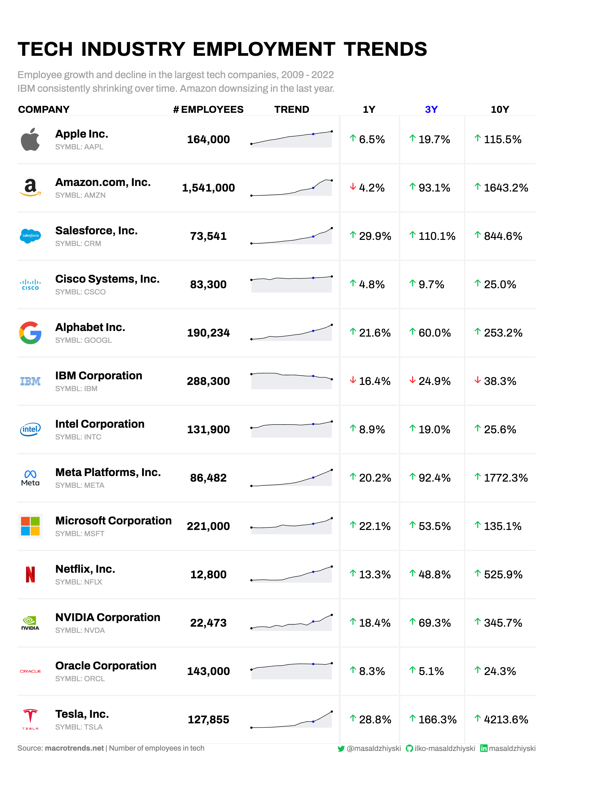
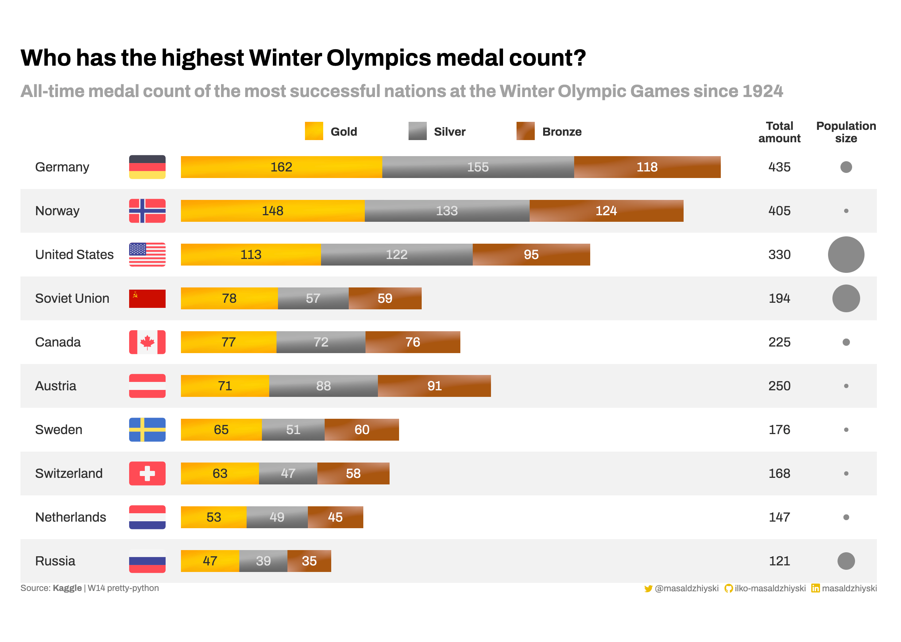
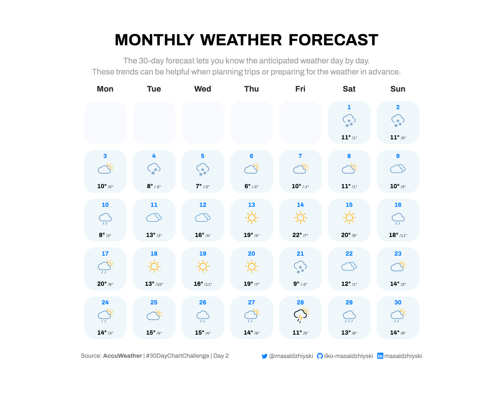

# pretty-python
A repo containing, *hopefully*, good looking visualizations built on top of python and pandas.

## Gallery

<table style="width: 100%; border: none;" cellspacing="0" cellpadding="0" border="0">
  <tr valign="top">
    <td><a href="./2023/W13">Tech industry employment trends</a></td>
    <td><a href="./2023/W14">Who has the highest Winter Olympics medal count?</a></td>
    <td><a href="./2023/30DayChartChallenge/Day01-part-to-whole">Share of OPEC oil reserves</a></td>
  </tr>
  <tr>
    <td><a href="./2023/30DayChartChallenge/Day02-waffle">Monthly Weather Forecast</a></td>
  </tr>
</table>